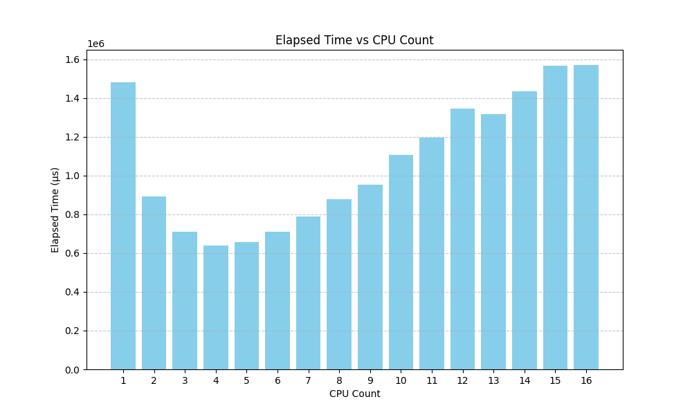

# Zig Notes

This document was written by me with contributions from Claude, Bing Copilot, Deepseek, and ChatGPT.  
**Note:** None of us are experts in Zig, and Zig 0.13.0 is not well-covered in the models.

---

## Performance

Built with `zig build -Doptimize=ReleaseFast`, the program runs in about **~~3.5~~ 1.5 seconds**, compared to **10 seconds** for the Haskell version.

### Optimizations

1. **Algorithm Change**:  
   Instead of tracking visited blocks in a hashmap, I implemented the classic "tortoise and hare" algorithm. This involves two iterators traversing the path—one at normal speed and the other at double speed. If they meet, a loop is detected. This optimization reduced the runtime from **3.5 seconds to 1.5 seconds**.

2. **Parallelization**:  
   The next optimization was to use multiple threads running in parallel.  
   - **Best Performance**: 4 threads (diminishing returns observed beyond this).  
   - **Key Insight**: Each thread was given its own memory allocator to avoid contention.

---

## Graph

Below is an image showing the performance results:

